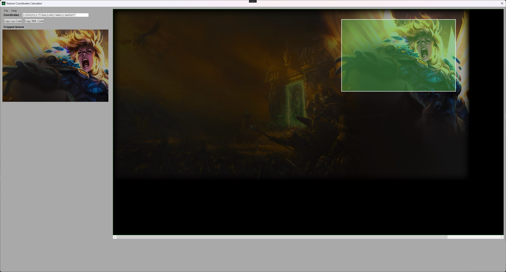

 Texture Coordinates Calculator
--------------

* [Overview](#overview)

* [Requirements](#requirements-for-compiling)

* [Build instructions](#build-instructions)

* [Usage](#usage)


## Overview
Calculates texture coordinates automatically, by selecting off the desired area directly through your .BLP file. If you are tired to do this manually, so this little application is specially designed for you :)


## Requirements for compiling

Since it used C# and WPF, some dependencies are required before using this project. Make sure you have the following :

- [Visual Studio](https://visualstudio.microsoft.com/), [Visual Studio Code](https://code.visualstudio.com/) or your favorite IDE.

- [.NET SDK](https://dotnet.microsoft.com/download)

- [Git](https://git-scm.com/)

## Build instructions

1. **Clone the repository** :

```sh
git clone https://github.com/helnesis/TextureCoordsCalculator.git
```

3. **Navigate to the project directory, get the submodule** :

```sh
cd ./TextureCoordsCalculator.git
git submodule update --init --recursive
```

You're now ready to compile the project, through your favorite IDE or ``dotnet build``

## Installation

* Get the latest release [here](https://github.com/helnesis/TextureCoordsCalculator/releases)

* Install .NET 8.0 Runtime [here](https://dotnet.microsoft.com/en-us/download/dotnet/thank-you/runtime-desktop-8.0.7-windows-x64-installer)

Have fun !

## Usage

It is quiet easy, open ``TextureCoordsCalculatorGUI.exe``, open your texture, select the desired area. Coords will appear!



You can also open a distant file, with [Wago](https://wago.tools/).


## Caution

I've developped this tool because I was tired of doing the coordinates manually. Since it was created for my specific use case, I do not guarantee that it will cover all potential use cases. But I'm open to all proposals.

P.S : I hate making UI, so yes, it is ugly AF. My apologies in advance, for your eyes.